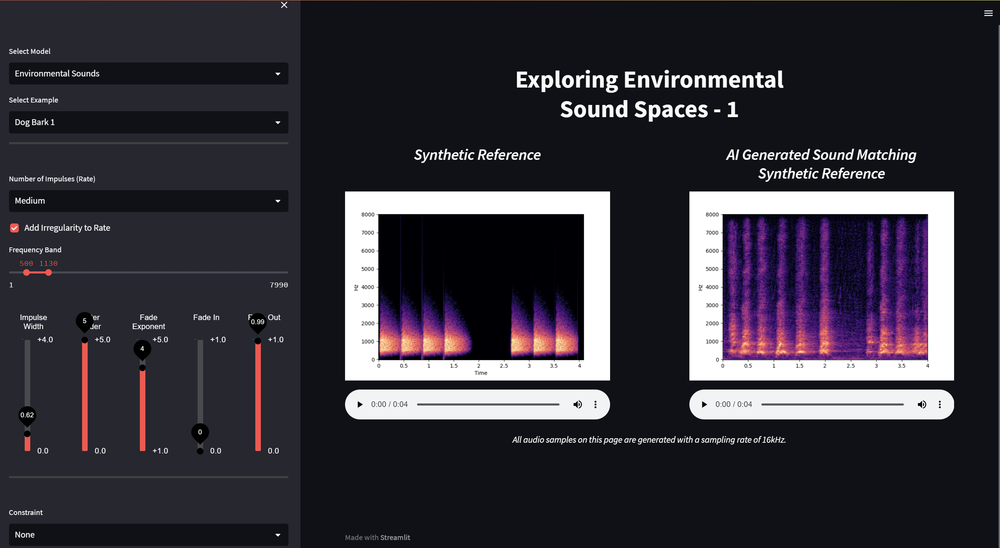
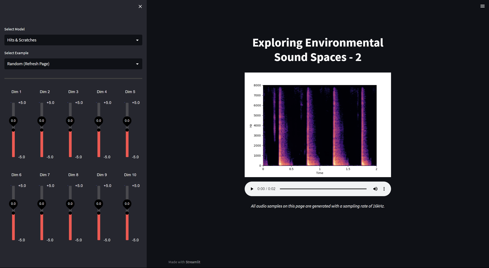

# Audio Design Toolkit





Multipage app. 

Run - 
```
cd interface
streamlit run app.py --server.port=<port number>
```

Additional Libraries:
- librosa               0.10.0
- numpy                 < 1.24
- lpips                 0.1.4
- typing-extensions     4.6.3
- pyloudnorm            0.1.1
- mixpanel

## Run with Docker

This guide provides instructions on how to run the application using Docker, a containerization platform that allows you to package your application and its dependencies into a single, portable container.

### Prerequisites

Before you can run the project using Docker, make sure you have the following prerequisites installed on your system:
- [Docker](https://www.docker.com/get-started) - Download and install Docker for your operating system.

Our Docker Image takes up roughly **7.5 GB** of space.

### Getting Started
1. Clone the project repository to your local machine:
```bash
git clone https://github.com/augmented-human-lab/audio-design-toolkit.git
cd audio-design-toolkit
``````

2. Build the Docker image for the project:
```bash
docker build -t sound-design .
``````
This command will create a Docker image with all the project dependencies.

3. Run the Docker container:
```bash
docker run -p 8100:8100 sound-design
```

Available URLs:
- http://localhost:8100/sound_design/?app=algo1
- http://localhost:8100/sound_design/?app=algo2
